# The canonical bacterial RT/retron catalogue: an extended Stage-1 characterisation

A scientific synthesis over the landed Stage-1 measurement bundles (g1–g7) and the registered canonical datasets. It computes no new measurement of record: every number is a view over landed Stage-1 data, and every re-derivation is reconciled against the value its gate landed.

> Bundle: `results/dbchar_g7b_stage1_extended_report` — a reporting layer over the landed Stage-1 gates g1–g7. No claim status is proposed; `human_input_audit` is PENDING.

## 1 · Corpus and redundancy structure

*units: raw record → distinct record → locus → physical locus → exact RT · denominator: the RT-anchored population of the g1 corpus pin*

**What is measured.** The catalogue's 3,059,700 raw RT-anchored records collapse to 3,051,238 distinct records, 2,847,312 loci, 2,475,684 physical loci and 501,561 exact RT proteins across 1,542,433 genomes. The last step is the large one: 16.4% of the raw records survive as distinct proteins, a 6.10-fold collapse. Only 8,462 records are literal duplicate lines; 203,926 are the same locus re-mined from a second database and 371,628 are RefSeq/GenBank twins of one physical locus.

**Principal observation.** The collapse factor is not a constant of the corpus but a property of each database: 5.49 loci per exact RT in ncbi_bacteria against 1.11 in mgnify_soil. Redundancy is also concentrated within families — the most re-deposited 1% of RVT-GII proteins account for 67.5% of that family's physical loci, and for Retron 73.2%.

**PROPOSED: reading.** **Technical, not biological.** The dominant signal in raw record counts is deposition practice: which catalogue a genome was submitted to, and how many near-identical genomes of a heavily sequenced species exist. Any statement about how common an RT is must name its unit; at the record unit it is largely a statement about sequencing effort.

**Would be wrong if.** the exact-RT key were collapsing genuinely different proteins. It cannot: it is the sha256 of the amino-acid sequence, and g2 verified that 0 loci carry conflicting RT sequences. The opposite error — one protein split across two keys by a single residue — remains possible and would make the collapse factor an underestimate.

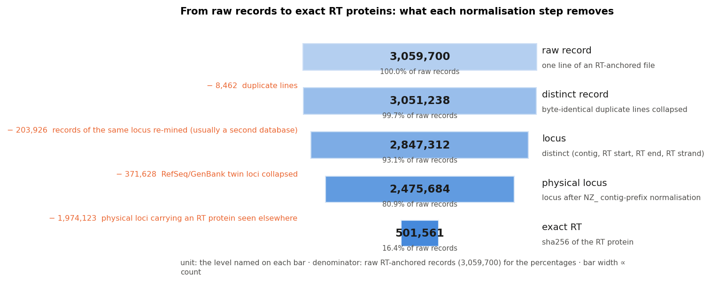

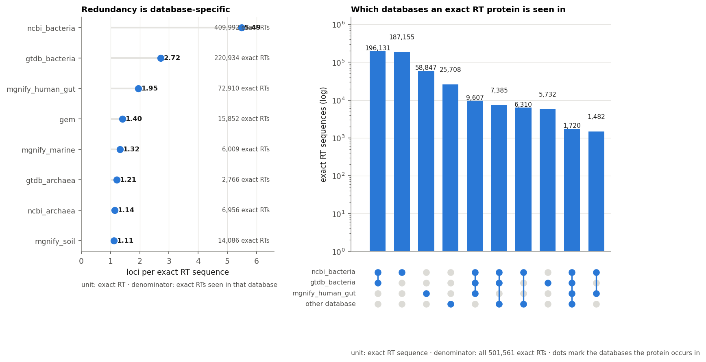

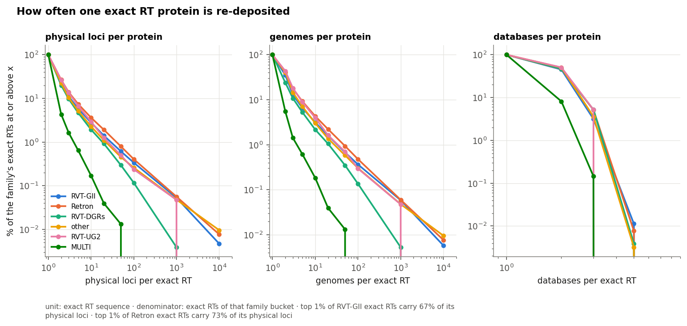

Landed tables: `tables/t01_unit_funnel.tsv`, `tables/t02_ladder_by_database.tsv`, `tables/t02_exact_rt_database_upset.tsv`, `tables/t03_recurrence_concentration.tsv`

> **Caveat.** A physical locus is a coordinate interval on a normalised contig accession. Two assembly versions of one contig remain two loci, so the twin collapse is a lower bound on deposition redundancy.

## 2 · RT-family composition, and what the unit does to it

*unit: exact RT sequences, with loci and records shown beside them · denominator: all RT-anchored units of that level*

**What is measured.** Family share at four units. RVT-GII is 52.9% of raw records but 51.2% of exact RT proteins. The families move in opposite directions: RVT-DGRs gains 2.03× share when counted on proteins rather than records, Retron loses (0.72×).

**Principal observation.** Ranking families by raw records and by distinct proteins gives materially different pictures of the catalogue. The MULTI stratum (7,593 exact RTs) is kept as its own bar throughout and never merged into a family.

**PROPOSED: reading.** **Technical.** The families that shrink are those sampled from heavily re-sequenced clinical genera; the families that grow are those found once per genome in diverse hosts. This is the C1/C2 evidence in one figure: the same catalogue supports two different family rankings depending on the declared unit.

**Would be wrong if.** family labels were unstable across records of one protein. g2 flags the 20 multi-label records inside single-family files and g4 keeps the 12 V-RT-CROSS proteins out of every family; both are excluded from the single-family view rather than silently assigned.

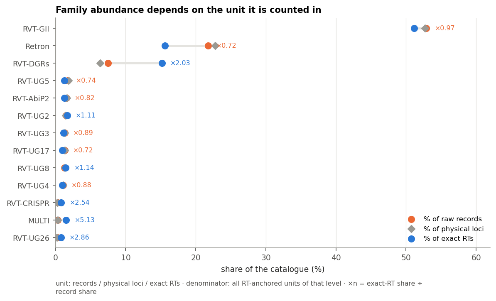

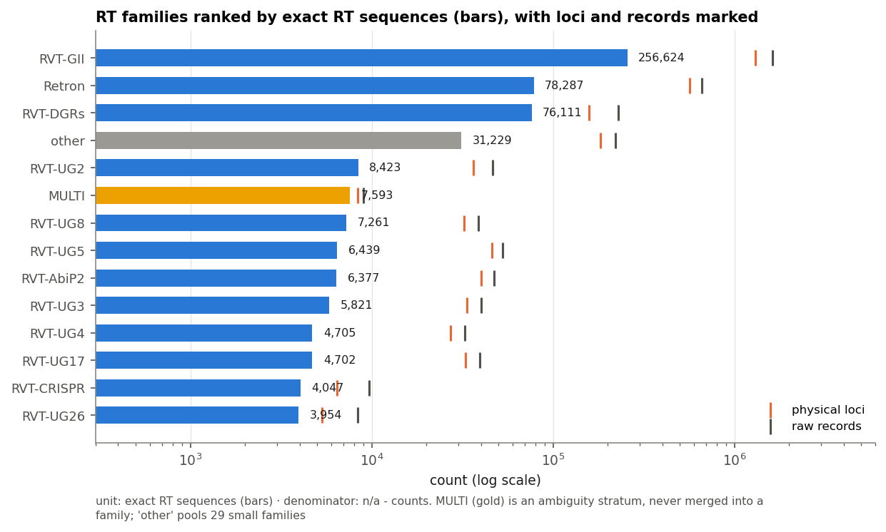

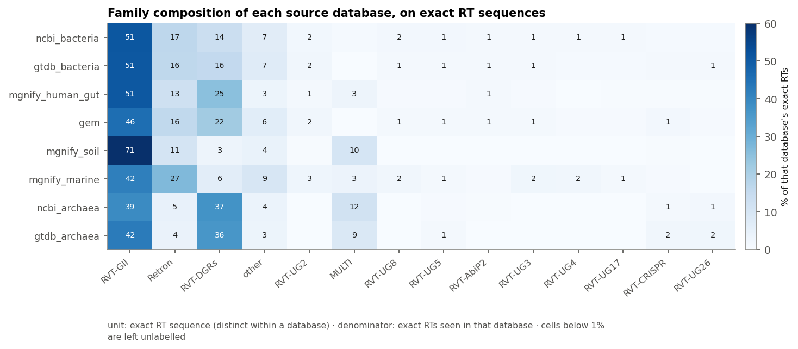

Landed tables: `tables/t04_family_share_by_unit.tsv`, `tables/t06_family_ranked.tsv`, `tables/t05_database_family_composition.tsv`

> **Caveat.** 'other' pools 29 small families for the figure only; the table carries every family separately.

## 3 · RT length

*unit: exact RT sequences (V-RT-SINGLE; MULTI separate) · denominator: exact RTs of that family and Prodigal completeness class*

**What is measured.** Length distributions per family, split by whether Prodigal called the ORF complete or partial. RVT-GII has a median of 407 aa and Retron 342 aa; within Retron, complete ORFs run 366 aa against 255 aa for partial ones.

**Principal observation.** Several families are not unimodal under the declared mode-counting rule: RVT-CRISPR resolves into 4 modes and RVT-GII into 2. The partial class is shifted low in every family, which is what a truncation flag should do.

**PROPOSED: reading.** **Mixed.** The complete/partial split is technical and behaves as expected. The multimodality of RVT-CRISPR and RVT-GII survives that split and is a candidate for domain-architecture heterogeneity — but Stage 1 measures length, not domains, and the launcher puts domain analysis out of scope.

**Would be wrong if.** the mode rule were finding noise. It is declared in advance, smooths at 10 aa, requires a peak to reach 10% of the maximum and a valley below 60% of the lower peak, and a control shows it returns 2 on a constructed bimodal sample and 1 on a unimodal one.

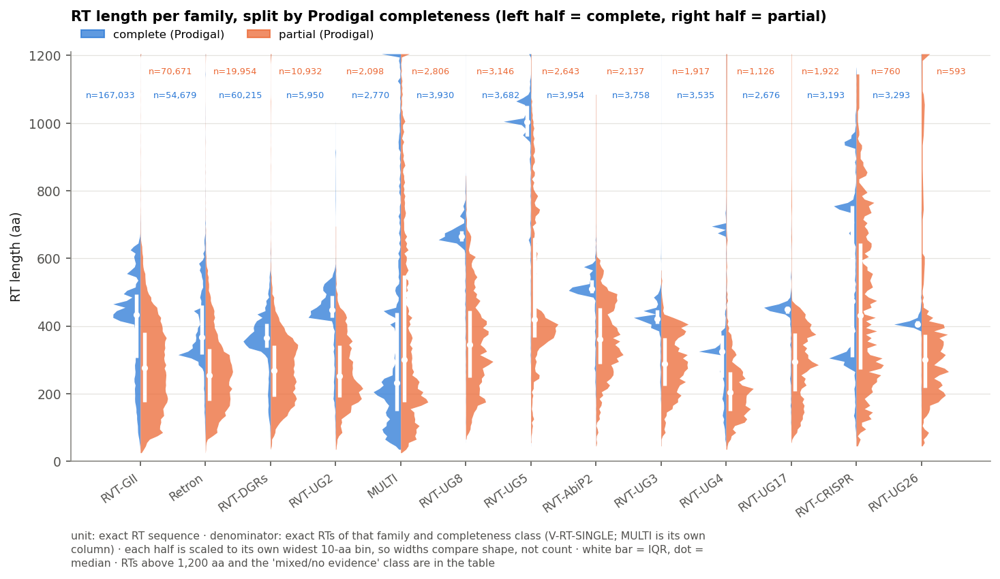

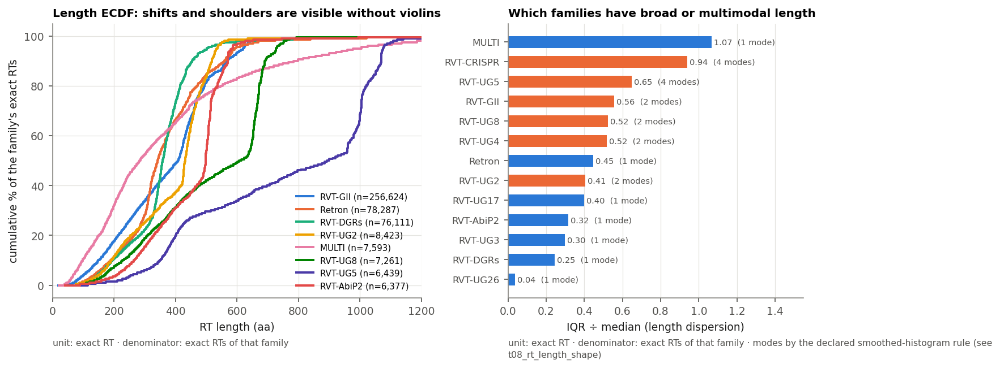

Landed tables: `tables/t07_rt_length_quantiles.tsv`, `tables/t08_rt_length_shape.tsv`

> **Caveat.** A missing Prodigal flag is 'no completeness evidence', never 'partial' (g4); those RTs and the 'mixed' class are in the table but not drawn.

## 4 · ncRNA length and covariance-model composition

*unit: exact ncRNA sequences and CANONICAL placements · denominator: as named per panel*

**What is measured.** Length and usage of the 21 retron covariance models. Median lengths run from 94 nt (TypeIV) to 264 nt (TypeIIIA3); TypeIA_IIAI, the most-used model, calls 2,109 distinct sequences at a median 159 nt.

**Principal observation.** Model composition changes with the unit exactly as family composition does: TypeIA_IIAI is 43.5% of placements but only 12.5% of distinct ncRNA sequences, while OutgroupA is 3.16% of placements and 20.7% of sequences. The subtype × model heatmaps are close to diagonal: each tool's subtype label corresponds to one model, which is what shared model lineage predicts.

**PROPOSED: reading.** **Technical.** The placement-level dominance of TypeIA_IIAI is re-deposition (§5), not diversity. The near-diagonal subtype × model structure means 'which subtype' and 'which CM' are close to the same variable, and neither can be used to validate the other.

**Would be wrong if.** one ncRNA sequence were called by several models — it would break the diagonal reading. g3 measured this: 0 of 16,458 exact ncRNA sequences are called by more than one model, which is imposed by the pipeline's winner-take-all model selection and is therefore not evidence about model specificity.

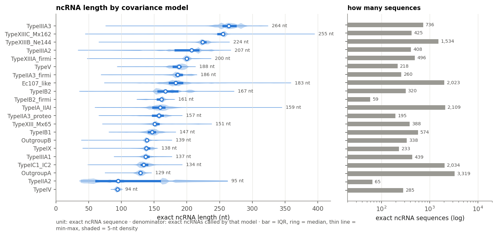

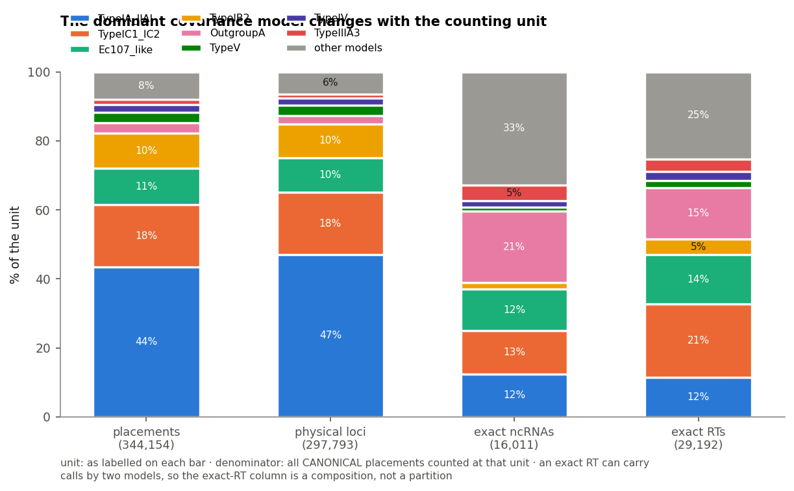

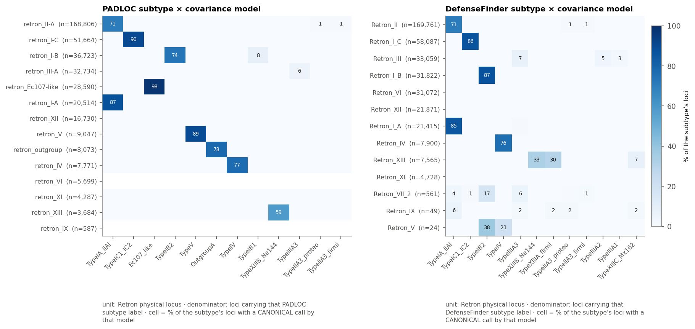

Landed tables: `tables/t09_ncrna_length_by_model.tsv`, `tables/t10_model_composition_by_unit.tsv`, `tables/t11_subtype_by_model.tsv`, `tables/t11_structure_annotation_by_model.tsv`

> **Caveat.** Structure annotation is sparse and uneven across models (4.41% of TypeIA_IIAI sequences carry one). Missing structure annotation is a missing field, never evidence that no structure exists.

## 5 · RT↔ncRNA genomic geometry

*unit: CANONICAL placements, the same placements re-counted as physical loci and as exact pairs · denominator: all CANONICAL placements (344,154)*

**What is measured.** Every CANONICAL placement assigned to one of eight exclusive configurations. Two dominate: an ncRNA immediately upstream of the RT (193,375 placements, 56.2%) and an ncRNA upstream across a long empty intergenic gap (118,275, 34.4%). One intervening CDS accounts for 12,398 (3.60%), overlap with the RT CDS for 12,118 (3.52%), and the known technical clipped mode for 5,234 (1.52%). 94.4% of placements have no CDS at all in the gap; upstream placements are on the RT's own strand in 99.1% of cases.

**The second upstream mode is one protein.** The long-gap configuration looks like a second biological architecture and is not one. Its 900–1,100 bp band holds 127,078 placements but only 1,938 distinct exact RTs — 102,853 of them come from a single protein, and 111,581 from *Salmonella_enterica*. Counted as exact pairs the configuration falls from 118,275 to 1,908 (against 23,516 for the adjacent class), and it spans 1,268 species against thousands for the adjacent class.

**PROPOSED: reading.** **Technical for the mode, biological for the shape.** The canonical retron architecture in this corpus is an ncRNA a few tens of bases upstream of the RT, on the same strand, with no gene between them — that survives every change of unit. The 1 kb mode is a redeposition artefact of one Salmonella locus and must not be reported as a second architecture. The ~2.7 kb downstream mode is g3's contig-start clipping artefact (18 distinct ncRNA sequences across 15 species) and is excluded from every biological reading here.

**Geometry differs by model.** TypeIC1_IC2 sits at a median -31 bp, TypeIA_IIAI at -1,037 bp (the Salmonella mode), TypeXIIIA_firmi at -4,705 bp, and 57.8% of TypeV loci fall inside the technical clipped mode.

**Would be wrong if.** the intervening-CDS count were wrong, since three configurations depend on it. An independent recount from `rt_window_cds_v1`, sharing no code with g3, reproduced it on 5,000 sampled placements at 100.0%.

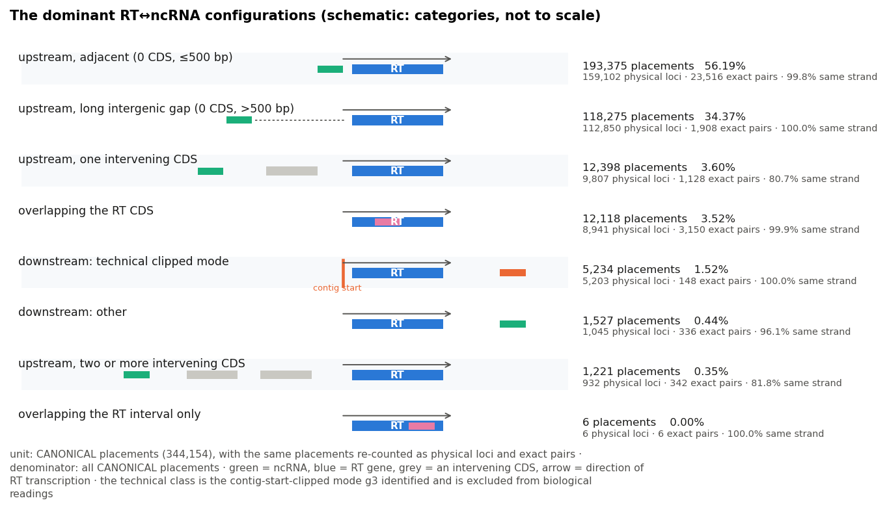

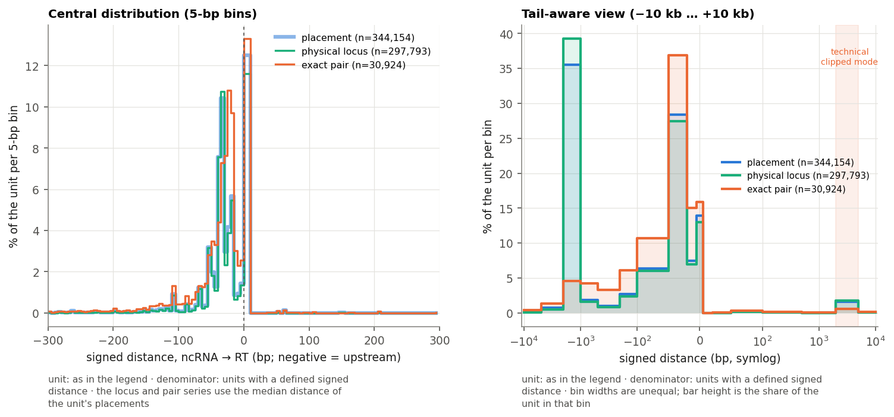

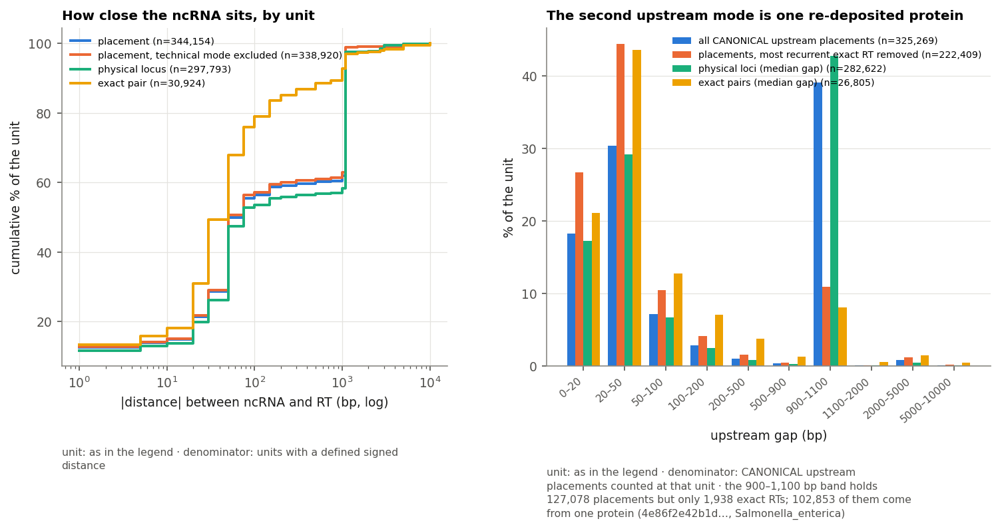

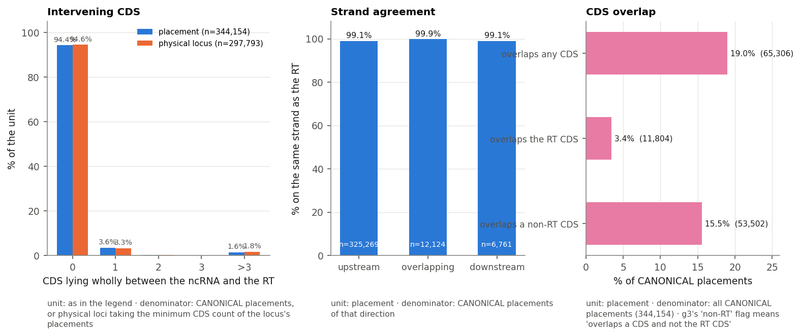

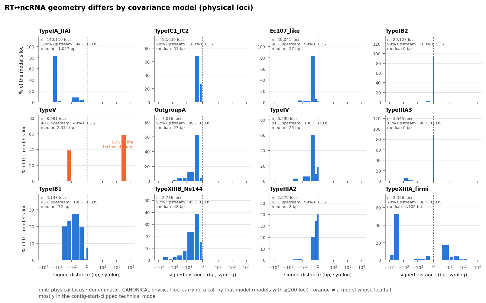

Landed tables: `tables/t12_configuration_classes.tsv`, `tables/t14_gap_mode_composition.tsv`, `tables/t15_cds_between_by_unit.tsv`, `tables/t16_geometry_by_model.tsv`, `tables/t27_old_report_reconciliation.tsv`

> **Caveat.** 3,041 placements (0.88%) are on the opposite strand and 1,527 are downstream outside the technical mode. They are retained, not filtered, and are the natural starting population for an atypical-architecture question.

## 6 · Tool intersection and ncRNA carriage

*unit: Retron records, loci, physical loci and exact RTs · denominator: units of that tool combination*

**What is measured.** The seven tool-call combinations over Retron loci, with ncRNA carriage in each. All three tools agree on 311,258 physical loci, of which 71.2% carry a canonical ncRNA; myRT alone reaches 12.9% and myRT+PADLOC 89.2% (48,454 loci). Only 12 loci have records that disagree about which tools called them.

**The gradient is partly definitional.** PADLOC's own rule files decide part of this. In 17 of 18 retron rules the ncRNA is a scoring element; for `retron_Ec107-like` and `retron_outgroup` the rule cannot be satisfied without a second element, so an ncRNA is required in practice; for `retron_XII` the ncRNA is a **prohibited** gene. A carriage rate computed on a PADLOC-defined subset is therefore partly a restatement of the rule.

**But composition does not explain all of it.** Holding the PADLOC subtype fixed, carriage still moves with the tool combination: retron_II-A runs 73.1% at three-tool agreement against 11.5% in myRT+PADLOC, while retron_III-A stays low throughout (22.3% at three-tool agreement). The myRT-only and DefenseFinder-only columns cannot be compared this way at all: a locus PADLOC did not call carries no PADLOC subtype.

**PROPOSED: reading.** **Unresolved, and this bundle does not resolve it.** The Stage-1 conclusion stands unchanged: a tool-defined subset of this corpus is not a random subset, and the carriage gradient is confounded with detector definition. What is added here is that the gradient survives at the exact-RT unit (53.1% for three-tool agreement) and is not purely subtype composition.

**Would be wrong if.** 'detected by' meant 'the tool was run and returned negative elsewhere'. It does not: a tool absent from a record cannot be distinguished from a tool never run on that genome, which is a limit of the corpus, not of the analysis.

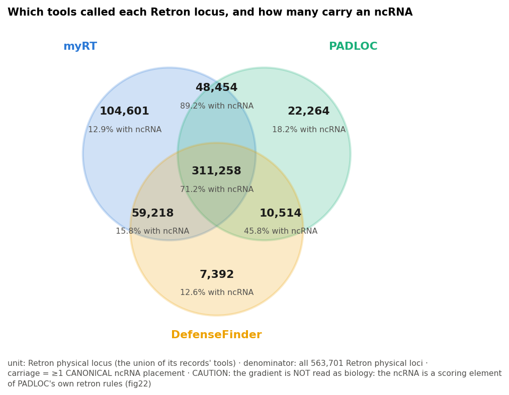

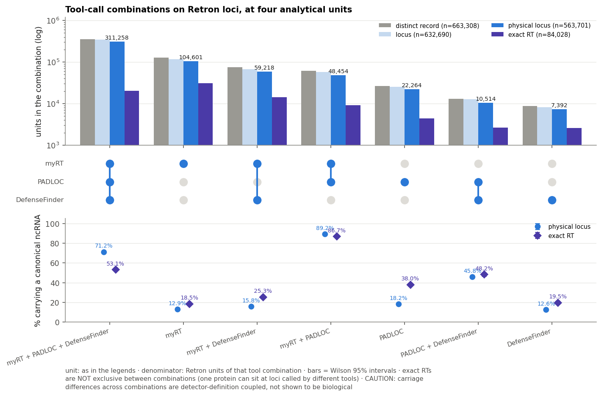

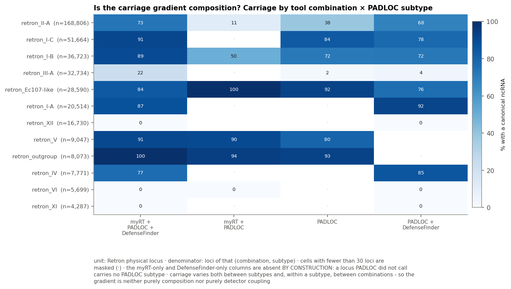

Landed tables: `tables/t18_tool_combination_carriage.tsv`, `tables/t20_combo_by_padloc_subtype.tsv`, `tables/t22_padloc_rules.tsv`

> **Caveat.** A locus's combination is the union over its records. Exact RTs are NOT exclusive between combinations, so the exact-RT row of the UpSet is a composition, not a partition.

## 7 · Retron ncRNA detection coverage and the zero-call class

*unit: Retron physical loci · denominator: Retron physical loci of the named stratum*

**What is measured.** How many Retron loci carry no ncRNA call, and what predicts it. In ncbi_bacteria 44.7% of 425,905 physical loci have none. Loci carrying two *distinct* ncRNA sequences are rare (18 in ncbi_bacteria): the apparent 'two ncRNA' class is mostly one call arriving twice from a RefSeq/GenBank twin (46,071 loci in the twin stratum).

**Most of the zero class is missing context.** Carriage rises monotonically with the window context available upstream of the RT: 0.78% of 6,636 loci with no upstream context at all, 15.8% in the 1–200 bp bin, and 60.5% of 419,613 loci with more than 9 kb and no clipping. The canonical ncRNA sits a few tens of bases upstream, so a locus whose window starts at the RT cannot show one.

**PROPOSED: reading.** **Technical and definitional, not biological absence.** The Retron zero-ncRNA rate is an upper bound on missingness, composed of at least three effects: windows clipped at a contig start, subtypes whose PADLOC rule prohibits or does not require an ncRNA, and genuine model gaps. retron_XII's 0.01% over 16,730 loci is a rule; retron_VI's 0.02% over 5,699 loci is not explained by the rule and is the better candidate for a real model gap.

**Outside Retron this measures nothing about biology.** The zero rate is 47.4% for Retron-labelled loci and 100.0% for RVT-GII. The covariance models in this corpus are retron models; outside Retron the rate measures where the detector was pointed.

**Would be wrong if.** the context gradient were an artefact of the eligibility filter. It is computed on geometry-eligible loci only, and the clipped and unclipped strata are plotted separately so the gradient can be read within each.

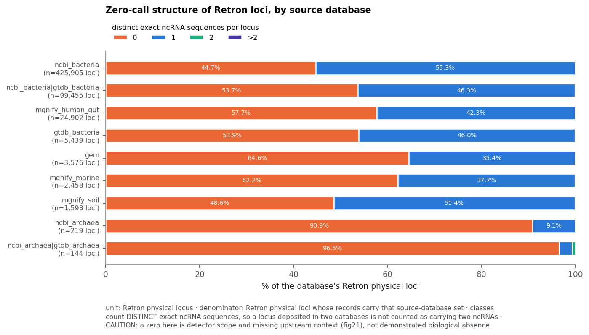

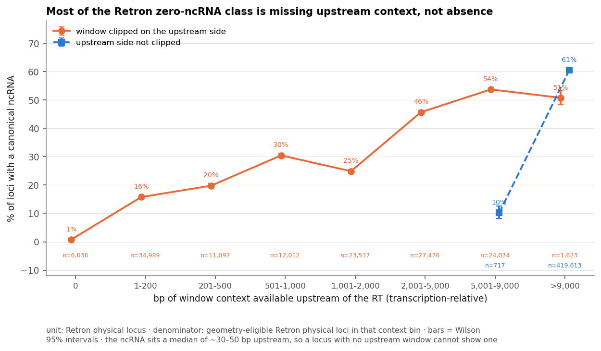

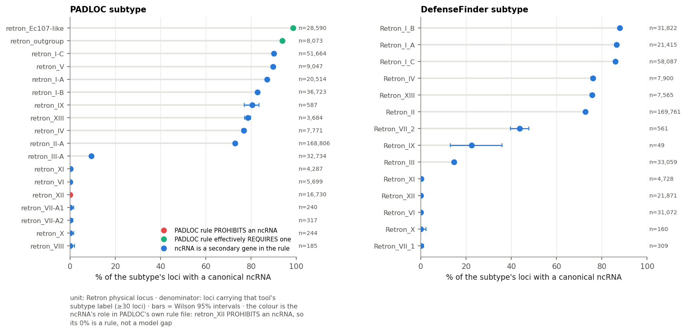

Landed tables: `tables/t23_zero_call_by_database.tsv`, `tables/t24_carriage_by_upstream_context.tsv`, `tables/t21_carriage_by_subtype.tsv`, `tables/t23_zero_call_by_family.tsv`

> **Caveat.** A positive control exists for the instrument: the same pipeline recovers ncRNAs at 28,590 retron_Ec107-like loci at 98.6%. A zero is therefore a statement about scope and context, never about the organism.

## 8 · Exact RT–ncRNA pairing topology

*unit: the 30,924 distinct (exact RT, exact ncRNA) pairs and their components · denominator: as named per panel*

**What is measured.** The bipartite structure of the exact-pair view: 12,079 strictly one-to-one components, 2,293 many-RT-to-one-ncRNA and 367 many-to-many. 12,005 pairs occur exactly once.

**Recurrence is mostly deposition.** 30.3% of pairs recur only as copies of one physical locus in several databases. Pairs recurring across species are 16.3% of pairs but 79.4% of placements — the few genuinely widespread pairs dominate any placement-level count.

**Recurrent proteins keep their partner.** Among exact RTs found at 100 or more physical loci (139 proteins), 87.8% carry the same dominant exact ncRNA partner at 90% or more of their loci, and 100.0% use a single covariance model. Where a protein does have several partners, 99.2% of those partner sets are still called by one model.

**PROPOSED: reading.** **Biological, with a technical floor.** Partner identity travelling with an exact protein across hundreds of deposits is consistent with a tightly coupled RT–ncRNA unit. The floor is that many of those loci are copies of the same deposit, so the honest statement is at the pair-and-species level: the cross-species pairs are the ones worth a co-evolution question, and they are a minority of pairs.

**Would be wrong if.** 'a different exact ncRNA' meant 'a different ncRNA family'. It does not — two sequences differing by where the model cut the boundary are two nodes here and one molecule in biology. g3 tested the co-located case (366 sequence pairs at one locus, all with disjoint intervals) but the corpus-wide node count remains an upper bound on distinct molecules.

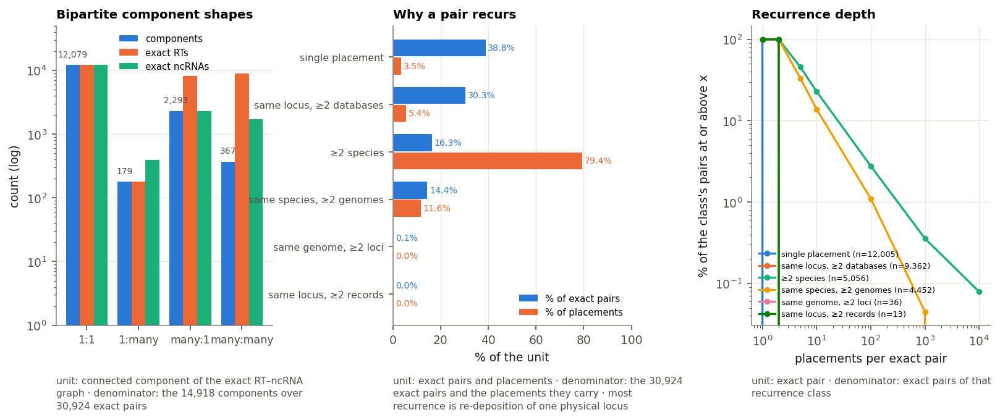

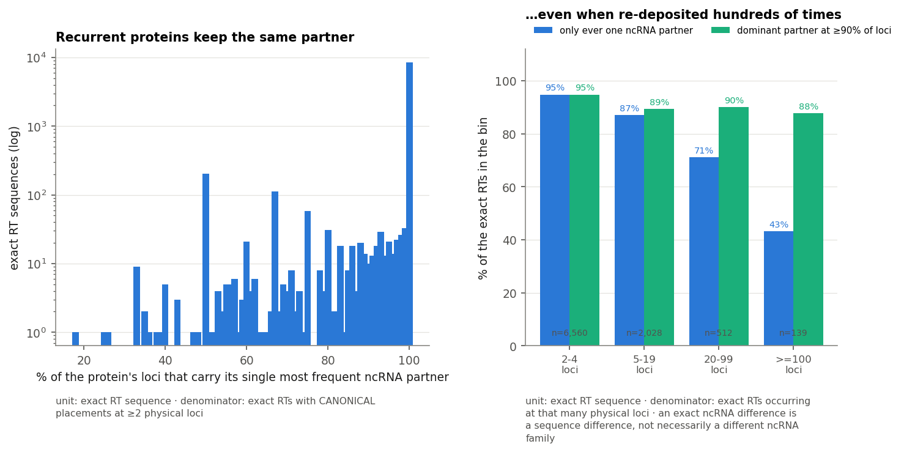

Landed tables: `tables/t28_topology_components.tsv`, `tables/t29_recurrence_classes.tsv`, `tables/t30_partner_consistency.tsv`, `tables/t30_partner_sequence_vs_family.tsv`

> **Caveat.** The exact-pair view is built on CANONICAL placements only, so a pair present only in an atypical or ineligible placement is absent from it.

## 9 · Atypical non-Retron retron-CM candidates

*unit: the 266 retained placements · denominator: the candidate population, with CANONICAL Retron placements as the comparison*

**What is measured.** Every retron covariance-model call that landed beside an RT that is not labelled Retron. 260 single-family candidate placements (plus 6 in the MULTI stratum), spread thinly across RVT-GII, RVT-DGRs and a dozen other families and across most of the model library.

**Principal observation.** They do not look like retrons. 57.7% are upstream against 90.5% of CANONICAL Retron placements inside the declared Retron envelope (upstream, same strand, no intervening CDS, within 1.1 kb); only 10.8% of the candidates fall inside it, and their median separation is 2,665 bp against 52 bp for Retron.

**PROPOSED: reading.** **Unresolved; most likely annotation disagreement.** This is a candidate/atypical population, explicitly **not** novel or divergent retrons. The geometry is what a scattered low-scoring model hit beside an unrelated RT would look like; a handful of same-strand, close, upstream cases are the only ones that resemble the Retron prior and they are individually listed in the landed tables.

**Would be wrong if.** the family label were wrong rather than the model call. That is exactly what cannot be settled inside Stage 1, which is why the population is retained with its per-placement geometry rather than reclassified.

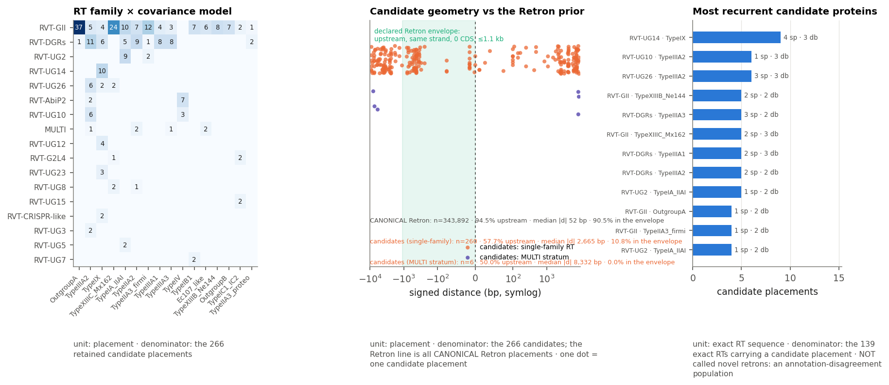

Landed tables: `tables/t31_candidates_family_model.tsv`, `tables/t31_candidates_vs_retron.tsv`, `tables/t31_candidate_exact_rts.tsv`

> **Caveat.** With 266 placements over ~40 family × model combinations, most cells hold single digits. No rate in this section should be read as a population estimate.

## 10 · MULTI: a real ambiguity stratum

*unit: the 7,593 V-RT-MULTI exact RT proteins · denominator: MULTI exact RTs, against g4's seeded single-family control*

**What is measured.** The best-vs-second HMM margin for every MULTI protein. The median margin is 5 bits against 81.70 bits in the control, and 74.6% of MULTI proteins sit below 10 bits against 2.30% of controls. The best-scoring family is among the record's own labels for 99.9% of them.

**Principal observation.** The ambiguity is concentrated, not diffuse: 5,355 MULTI proteins carry the RVT-CRISPR/RVT-GII pair, by far the largest cell of the family-pair matrix. MULTI records are otherwise ordinary — 0.07% carry an ncRNA call against 11.3% of single-family records, and 86.6% are geometry-eligible against 99.5%.

**PROPOSED: reading.** **Methodological, and unresolved by design.** MULTI is not mislabelling: the labels name precisely the profiles that score, and those profiles are a few bits apart. Choosing the top hit would impose a decision the evidence does not support. The concentration in specific family pairs says the boundary between those profile sets is where a classification effort should be spent.

**Would be wrong if.** the small margins were a length artefact — MULTI proteins are shorter than single-family ones and HMM score scales with length. The margin-vs-length panel shows the confound directly and Stage 1 does not separate the two.

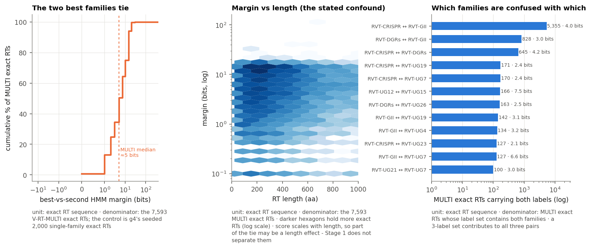

Landed tables: `tables/t32_margin_comparison.tsv`, `tables/t33_multi_family_pairs.tsv`, `tables/t33_multi_architecture.tsv`

> **Caveat.** These are HMM scores from one library at one setting. A different profile library could resolve some of these ties and create others.

## 11 · Taxonomic representation, and prevalence where a denominator exists

*unit: genomes · denominator: genomes of that taxon in the GTDB bacterial catalogue (prevalence), or records/exact RTs of the NCBI schema (representation)*

**What is measured.** For the gtdb_bacteria database only — where the corpus and the catalogue share the GTDB schema — the fraction of *sampled* genomes carrying at least one RT locus. Pseudomonadota: 51.8% of 267,130 sampled genomes. Actinomycetota: 17.7%. Chlamydiota: 11.8%.

**Principal observation.** Prevalence and burden separate. Cyanobacteriota is at 47.9% prevalence but 2.63 exact RTs per positive genome, the highest of the large phyla. At genus level the spread is wider still — Klebsiella 84.0% of 28,408 sampled genomes, Pelagibacter 0.00% of 1,374.

**Representation is not prevalence.** The NCBI block has no phylum by construction and no sampled-genome denominator, so nothing there may be called enriched. What it shows is redundancy: Escherichia is 20.1% of NCBI-schema records but 6.48% of exact RTs, and Salmonella contributes 25.64 records per distinct protein.

**PROPOSED: reading.** **Biological signal, technically bounded.** A prevalence difference between phyla computed against a catalogue denominator is a real difference in how often these genomes carry a detectable RT. It is not a clean estimate of biological prevalence: the catalogue is an upper bound on what the pipeline attempted, and the corpus records no pipeline failures, so every prevalence here is a floor.

**Would be wrong if.** the zero-prevalence genera were instrument failures. The same instrument recovered RT-positive genomes in 299,306 GTDB genomes including small-genome lineages, so a zero across a well-sampled genus is a recovery statement — but 'attempted and negative' and 'never attempted' cannot be separated in this corpus, which is why no absence claim is made.

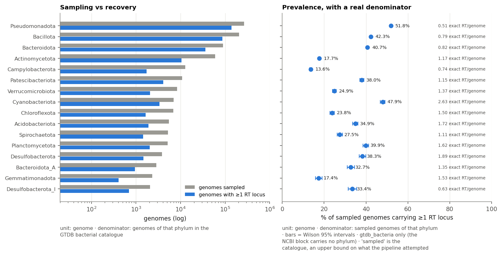

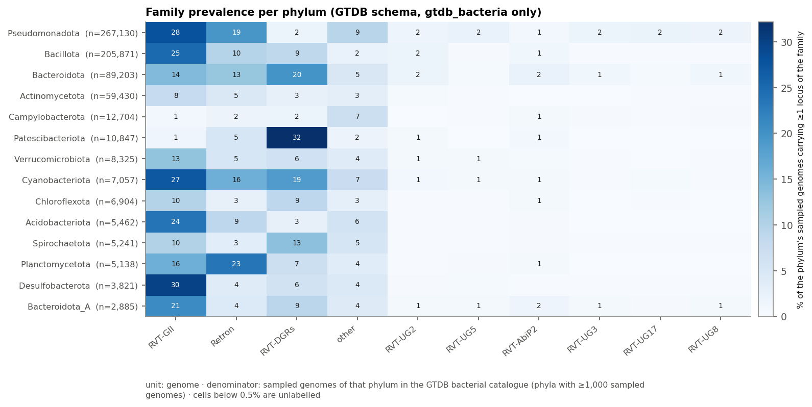

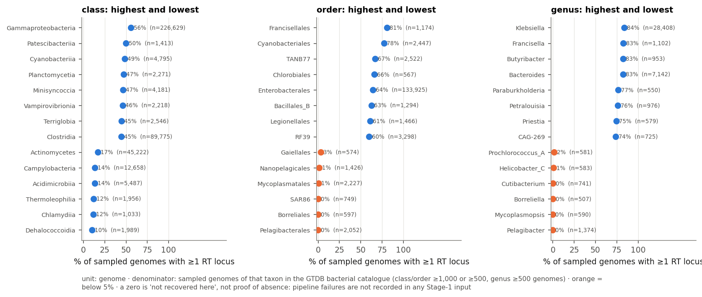

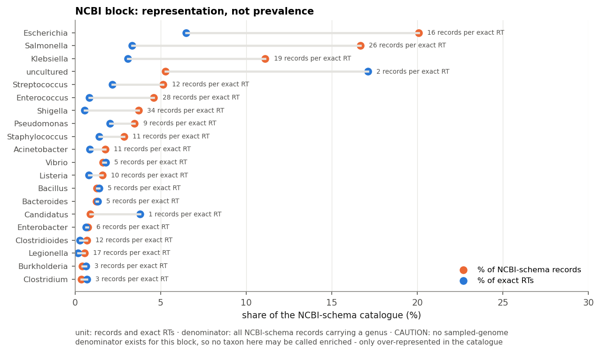

Landed tables: `tables/t34_gtdb_prevalence_by_rank.tsv`, `tables/t35_family_by_phylum_prevalence.tsv`, `tables/t36_ncbi_genus_representation.tsv`

> **Caveat.** GTDB and NCBI taxonomies are never pooled. All prevalence numbers are gtdb_bacteria only; the other seven databases contribute representation only.

## 12 · Data quality and eligibility: what a reader can inspect

*unit: distinct records · denominator: all 3,051,238 distinct RT-anchored records*

**What is measured.** Every distinct record placed in one inspectability tier. 39.1% are fully inspectable — exact back-translation, an RT CDS present, no clipping and no window-edge contact. 43.8% are geometry-eligible but clipped or edge-touching, 16.5% are geometry-eligible with a recoded translation, 16,752 records keep a usable sequence with no defensible genomic context, and 669 remain ill-posed.

**Principal observation.** Clipping is the dominant caveat, not translation failure: 41.0% of ncbi_bacteria records sit in a window clipped at the contig start. Records with no marked RT CDS come exclusively from the MAG catalogues — 12,667 of them recovered in mgnify_human_gut alone, and exactly zero from either NCBI or either GTDB catalogue.

**PROPOSED: reading.** **Technical.** The catalogue is usable at two very different levels of confidence, and §7 shows the practical consequence: the clipped fraction is where the ncRNA zero-class lives. An analysis that needs intact upstream context should declare the clipped stratum rather than inherit it silently.

**Would be wrong if.** 'fully inspectable' were doing more work than it can. It is a conjunction of five landed flags, not an assessment of whether the underlying assembly is correct.

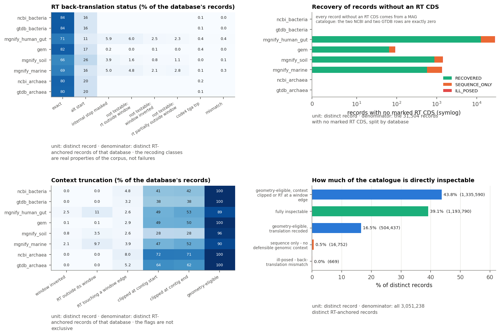

Landed tables: `tables/t40_inspectability.tsv`, `tables/t39_context_truncation_by_database.tsv`, `tables/t39_no_rt_cds_recovery_by_database.tsv`, `tables/t39_checkm_availability.tsv`

> **Caveat.** A CheckM-style completeness value exists for only about a quarter of genome entries (g5): the NCBI summaries carry no such column, so a quality filter can never speak for the whole corpus.

## 13 · Secondary associations unlocked by the canonical units

*unit: as named per panel · denominator: as named per panel*

**RT length and ncRNA carriage.** Carriage rises with RT length and with completeness: complete Retron proteins of 300–349 aa carry an ncRNA at 41.9%, partial proteins under 200 aa at 26.9%. This is association, not mechanism — short partial RTs also sit disproportionately in clipped windows (§7).

**High recurrence is not taxonomic breadth.** Among Retron proteins found in 20 or more genomes, 35.9% are confined to a single species (deposition or clonal expansion) and 19.6% span more than five species. A recurrence count alone therefore says nothing about host range.

**Databases annotate differently.** The tool mix is database-specific: 61.5% of ncbi_bacteria Retron loci have all three tools against 37.1% of mgnify_human_gut loci called by myRT alone. Within each tool combination the carriage ordering repeats across databases, so the §6 gradient is not a property of one catalogue.

**PROPOSED: reading.** **All three are associations on non-independent units.** They are reported with their units and denominators so a later stage can test them on a de-duplicated population; none is offered as a mechanism, and no hypothesis test is applied to counts inflated by re-deposition.

**Would be wrong if.** these were read at the record unit, where one heavily deposited locus can move a percentage point on its own. Every panel here is at the exact-RT or physical-locus unit for that reason.

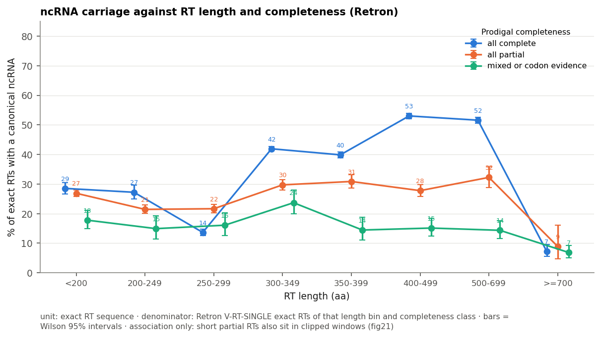

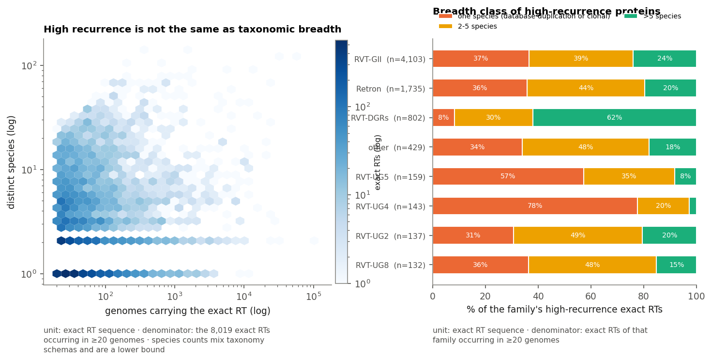

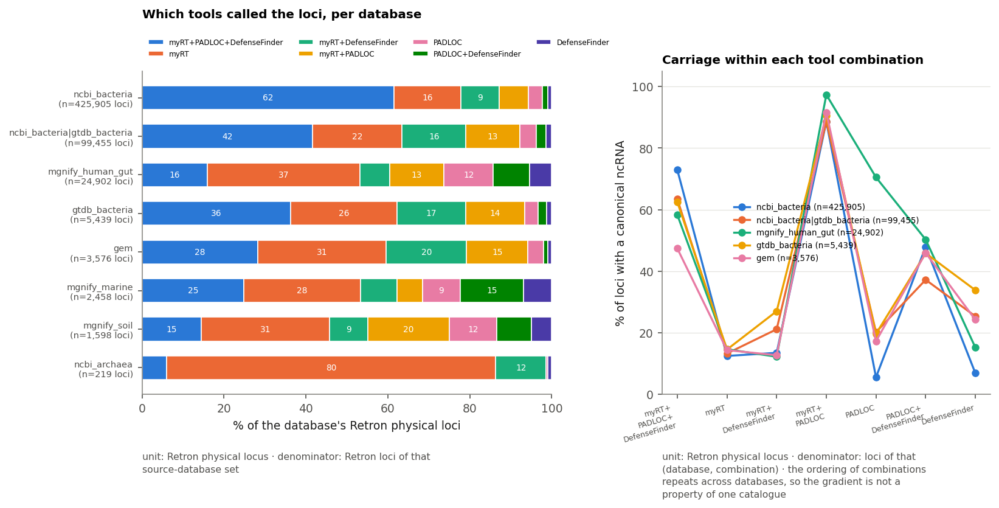

Landed tables: `tables/t25_carriage_by_rt_length.tsv`, `tables/t38_recurrence_breadth.tsv`, `tables/t26_tool_mix_by_database.tsv`, `tables/t37_carriage_by_host_completeness.tsv`

> **Caveat.** Host CheckM completeness is available only for GTDB/GEM/MGnify genomes, so the quality stratification in t37 covers a minority of the corpus.

## · What this bundle is not

This bundle is a **reporting layer**. It measured nothing new: every number above is a view over
the landed Stage-1 bundles and the registered canonical datasets, and every quantity that a
landed g1–g6 table also carries was compared against it before the report was built. The
comparison covers 294 quantities and found **0 disagreements**; where this bundle counts
something differently from a landed gate — coverage by placement versus by record, for instance —
the difference is landed as a declared definition difference, not presented as a correction.

`results/dbchar_g7_stage1_report/` remains the authoritative Stage-1 closeout and validation
report. Nothing in g1–g7 was modified, and **no claim status is proposed here**: the launcher
reserves promoting an interpretation to a thesis or paper claim for the operator, and
`human_input_audit` is PENDING for every Stage-1 bundle including this one.
