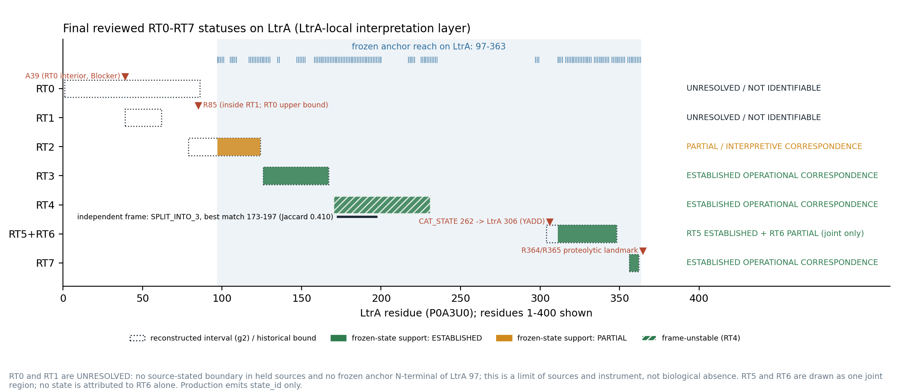
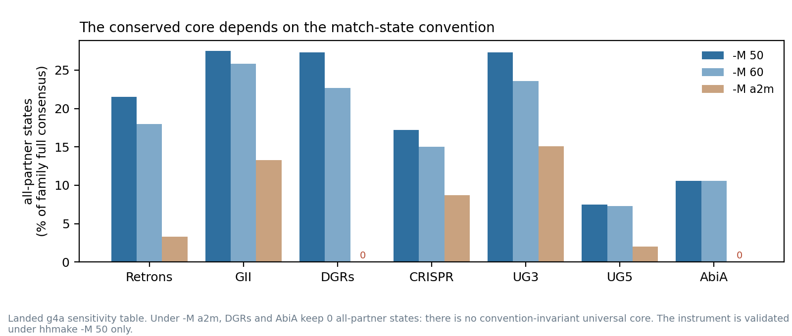
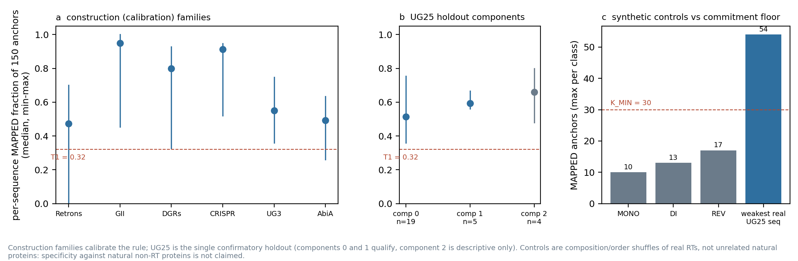
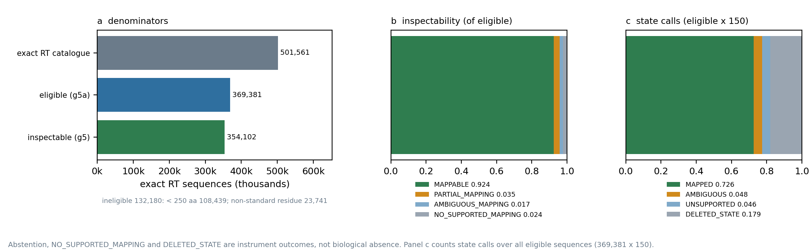
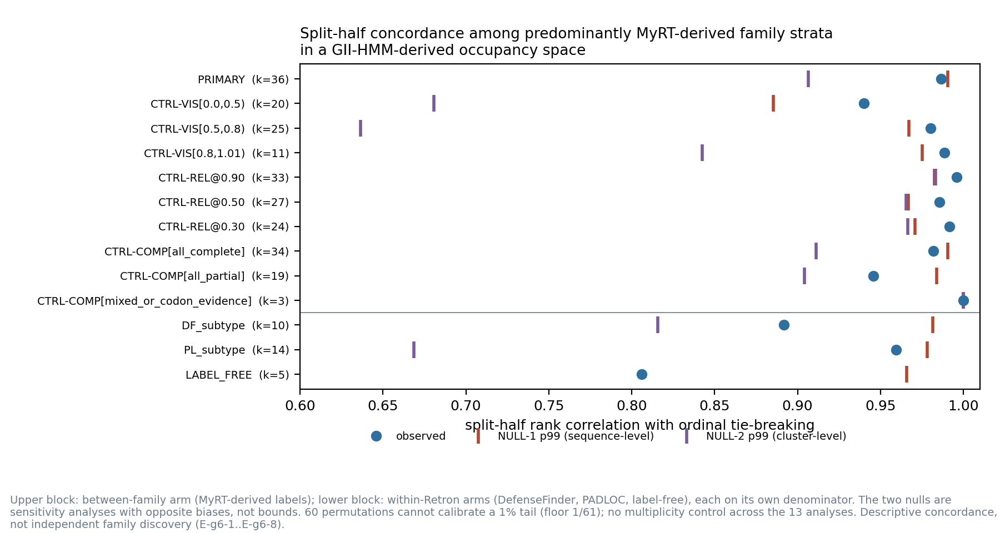
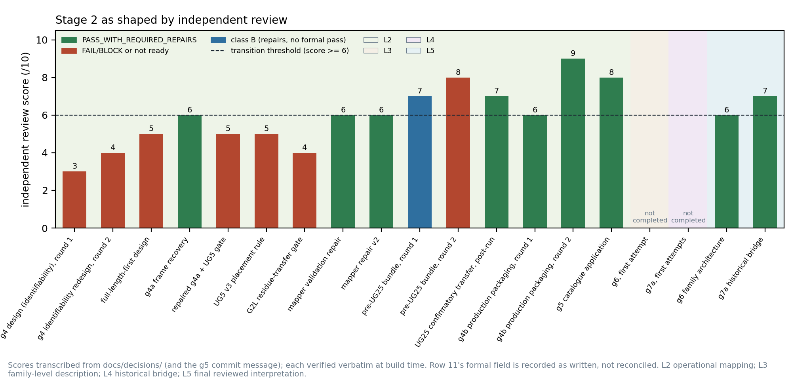

# Stage 2 — RT0–RT7 definition and the conserved-state mapper: final technical report

Source of record: `main` at `94a1a78868d6039297c78b3fdcc047d633d6645e`. Every number below is resolved at build time from
a landed table, a declared count over landed rows, or a literal checked against a reviewed record
(`tables/stage2_resolved_values.tsv` gives the source for each). This report computes nothing,
changes no frozen output and reopens no Stage-2 question.

`human_input_audit`: **PENDING** on the landed bundles. The governance layer requires that
audit before any number here becomes a thesis claim.

---

## 1 · Summary and final statuses

Stage 2 asked whether the historical reverse-transcriptase "domains" RT0–RT7 can be given an
operational meaning on modern RT sequences, and built a frozen instrument to test that. The
instrument is a conserved-state mapper, `rtmap-1.0.0/53a1e738a19b3896`. It places residues of any RT on
150 frozen conserved states of a group-II-intron-derived profile HMM (LENG
471, `hhmake -M 50`). It was validated by one confirmatory transfer to a fresh
lineage (UG25). It was then frozen and applied to the 369,381 eligible exact RTs of the
Stage-1 catalogue, of which 354,102 are inspectable. The mapped catalogue was used for
a family-level descriptive analysis (`g6`) and for a historical bridge from RT0–RT7 to the frozen
states on the group-II intron RT LtrA (`g7a`). Both passed independent, vendor-disjoint review
with zero blockers.

The final reviewed statuses, from the governing erratum table
`docs/errata/g7a_closure_decision_erratum_2026-09-19.tsv`, are:

- **RT0** — UNRESOLVED / NOT IDENTIFIABLE
- **RT1** — UNRESOLVED / NOT IDENTIFIABLE
- **RT2** — PARTIAL / INTERPRETIVE CORRESPONDENCE (only LtrA 97-123 of the reconstructed 79-123 is observed)
- **RT3** — ESTABLISHED OPERATIONAL CORRESPONDENCE, with qualification (Route C corroborates placement; it is not independent historical replication)
- **RT4** — ESTABLISHED OPERATIONAL CORRESPONDENCE, with frame-instability qualification (1:1 in the primary frame, split into three in the independent frame, Jaccard 0.410)
- **RT5** — ESTABLISHED OPERATIONAL CORRESPONDENCE, named only as the joint RT5+RT6 region; direct YxDD catalytic-feature anchor
- **RT6** — PARTIAL / INTERPRETIVE CORRESPONDENCE, jointly with RT5 only
- **RT7** — ESTABLISHED OPERATIONAL CORRESPONDENCE, with narrowed wording (strongest LtrA-local terminal coordinate, not "the strongest" correspondence without that qualifier)

All eight are **LtrA-local interpretation-layer correspondences**. Production emits `state_id`
only, and the production crosswalk stays `UNRESOLVED` in all eight rows. `g6` shows **descriptive
concordance of the mapper-derived descriptor across largely MyRT-defined strata**. It does not
show independent biological family discovery. Closure is workflow closure, not complete recovery.

## 2 · The scientific question and why RT0–RT7 was a problem

The retron and RT literature describes RT catalytic cores by numbered regions. Xiong & Eickbush
(1990) defined domains 1–7 by alignment. Later work added a domain 0 (RT0) for some
non-LTR-retrotransposon and group-II-intron RTs, and domain X beyond RT7. These labels are
still used to describe RT architecture and to compare RT families. Stage 1 left the project with
a catalogue of 501,561 exact RT sequences and no defensible way to say which residues of a
given RT belong to "RT3" or "RT0". There were three problems with the inherited labels:

1. **They were defined by procedure, not by coordinates.** Of 32 region names in
   the 6 held sources, 1 has a stated residue boundary;
   18 can be derived only as a procedure (align, then read printed columns).
2. **The defining source for RT0 is not held.** Malik, Burke & Eickbush 1999 could not be retrieved. What the
   held sources say about RT0 is an upper bound (the LtrA fragment M1–R85 *contains* RT0) and an
   interior point (A39). No held source states an RT0|RT1 boundary.
3. **Prior project frames were not independent evidence.** They were coordinate transfers over
   one anchor-derived landmark set (g3), so their agreement looked like replication but was not.

Stage 2 therefore separated the question into five layers and kept them apart in every
deliverable:

| layer | question | bundles |
|---|---|---|
| L1 historical definition | what did RT0–RT7 ever mean, on what evidence? | g1, g2, g3 |
| L2 operational mapping | can a frozen instrument map conserved states to residues, and does it transfer? | g4a → validation trail → UG25 → g4b → g5a/g5 |
| L3 family-level description | is the mapper-derived descriptor reproducible across family strata? | g6 |
| L4 historical bridge | how do historical labels correspond to operational states on LtrA? | g7a |
| L5 reviewed interpretation | what survives independent adversarial review? | review records, errata, closure |

## 3 · Data and analytical units

| unit | n | source |
|---|---|---|
| exact RT sequence, Stage-1 catalogue | 501,561 | `rt07_g5a_eligibility_census` |
| eligible (≥ 250 aa, 20 standard residues) — **the frozen denominator** | 369,381 | `g5a_census_summary.tsv` |
| ineligible: below minimum length / non-standard residue | 108,439 / 23,741 | same |
| inspectable (frozen verdict MAPPED) | 354,102 | `g5_qc_headline.tsv` |
| abstained (not failure, not absence) | 15,279 | same |
| state call (eligible × 150 anchors) | 55,407,150 | same |
| CAT_STATE-mapped sequence (**separate denominator**) | 356,229 | same |
| historical reference alignment ALIGN_000044 | 66 sequences × 1,441 columns | g1 |
| bridge substrate | LtrA (P0A3U0) | g7a |
| historical label | 8 (RT0–RT7) | g7a |

The analytical unit for the mapper is the **exact RT sequence**. For g6 it is the **family or
subtype stratum**, and for g7a it is the **historical label on LtrA**. Numbers from different
units are never pooled.

## 4 · L1 — Historical definition (g1, g2, g3)

**g1 — sources and evidence.** 6 held sources were read against 32
region names, giving a 192-cell evidence matrix with 53 cells carrying
evidence. 36 quotations were verified against the PDFs (0
unverifiable). The citation genealogy has 12 edges, 6 of them to
sources the project does not hold. The Zimmerly RT alignment ALIGN_000044 (submitted
13-NOV-2000) was acquired and verified. It carries 0 numbered
subdomain annotations, so every coordinate has to be reconstructed.

**g2 — independent reconstruction.** On ALIGN_000044 (66 proteins, 4
lineage groups) the project reconstructed conserved blocks independently in two alignment
frames. Conserved positions (81; null p = 0.0050) and the widest inter-block gap
(p = 0.0050) exceed their nulls. The **block count does not** (p = 0.6965):
6 blocks in frame 1, 7 in frame 2. The seven-way partition is recovered
in frame 2 (YES) and not in frame 1 (NO), so the verdict on the partition
itself is **NOT ESTABLISHED**. 5 blocks correspond one-to-one across frames
(median Jaccard 0.955). Block 4 is the exception: it splits into three in frame 2
(Jaccard 0.410). No block corresponds to RT0 (`rt0_block_created` = NO). The
main kill criterion (landmarks unrecoverable on their own substrate) was **NOT TRIGGERED**:
2 landmarks were recovered and 5 partially recovered.

**g3 — prior-method audit.** 13 prior project claims were regenerated.
2 reproduced on the same object and frame and 1 partially. 3
were circular or seed-dependent, 2 were object mismatches and 1 was a
frame mismatch; 2 had been withdrawn by the prior work itself and 2
were not testable. The prior anchors were 100.00% inside the seed that defined
them. 27/28 prior landmarks fall inside a g2 region, but only
4/29 prior-frame blocks were fixed by a published motif. RT5 and RT6
collapse onto a single reconstructed region, and RT0 is **OBJECT_MISMATCH**: the prior frame
spans LtrA 53-361 and does not cover RT0's source-stated alanine
A39.

**What L1 establishes.** RT2–RT7 can be reconstructed as **intervals** on LtrA. Placement is
recoverable; the number of numbered regions depends on the alignment frame. RT0 has no
recoverable coordinate object in the held evidence.

## 5 · L2 — The operational mapper

### 5.1 Design

Three design reviews rejected the first designs before the working design emerged (§8, F1). The rejected
designs tried to estimate RT0–RT7 architecture directly. They failed on identifiability. The
accepted design estimates something smaller: whether each of 150 frozen conserved
states of `GII.deriv.hmm` (LENG 471) is occupied by a residue of the query, and
which one. Each state call is **MAPPED** (posterior ≥ PP_HI 0.75), **AMBIGUOUS** (between
PP_LO 0.5 and PP_HI), **UNSUPPORTED** or **DELETED_STATE**. A sequence is committed
(verdict MAPPED) only if its domain bitscore exceeds S_MIN 10 and at least K_MIN
30 anchors are MAPPED. Otherwise it abstains with a reason code. DELETED_STATE means the
alignment path skips the state. It does not mean the region is biologically absent.

### 5.2 Calibration and construction validation

Parameters were calibrated on six construction families only and then frozen (T5,
`tables/stage2_frozen_parameters.tsv`). On 219 construction sequences, 217 were
committed. Median per-sequence MAPPED fraction ranged from 0.4733 (Retrons) to
0.9500 (GII), against the floor T1 = 0.32. The catalytic state was frozen as
CAT_STATE 262: 207 MAPPED [YF].DD occurrences, construction agreement
0.9857, runner-up state 136. CAT_STATE is **not** one of the 150
anchors and always has its own denominator.

### 5.3 Match-state sensitivity: no universal core

The set of states shared by all families depends on the HMM match-state convention (F3). Under
`hhmake -M 50`, GII keeps 148 all-partner states (27.5% of its full
consensus), and UG5 keeps only 7.5%. Under `-M a2m`, DGRs and AbiA keep
**0** and **0**. There is therefore no convention-invariant universal
conserved core. The instrument is validated under `-M 50` only.

### 5.4 Falsified transfer designs (retained)

- **UG5 v2** failed its predeclared criterion 2: monotone placement held for 31 of 67 sequences (46.3%). This is a valid falsifying result and is kept.
- **UG5 v3** was reviewed FAIL/BLOCK (5/10) because it was a detection sub-gate, not a mapper
  gate.
- **G2L residue transfer** was reviewed FAIL/BLOCK, 4/10. The predeclared criterion requiring
  support under a frozen score rule was not met (the gate code had no score or posterior), and
  G2L is a fresh family within a related lineage, not a fresh lineage. The review found no
  leakage into construction. This led to the posterior-based support rule and to an untouched,
  genealogically audited holdout (UG25).

### 5.5 UG25 confirmatory transfer (Endpoint A)

UG25 was opened once, after every parameter was frozen. The genealogy audit found
0 exact overlaps with construction and 0 of 28 sequences meeting the
full link rule, so UG25 is classified **FRESH_LINEAGE**. Both qualifying components passed C1
(medians 0.5133, n = 19; 0.5933, n = 5; T1 = 0.32).
Catalytic concordance C3 was 26/27 = 0.9630. The component difference C4 was 0.0800, within
D_MAX 0.48. This is a weak bound: the same-population null D_RANDOM is 0.067. Of
252 synthetic controls (MONO/DI/REV shuffles of real RTs), 252 were
valid. The largest MAPPED-anchor count in any control was 17 (MONO
10, DI 13, REV 17), against K_MIN 30 and a weakest
real UG25 sequence of 54. Post-run review: PASS_WITH_REQUIRED_REPAIRS, 7/10 — confirmatory
transfer SUPPORTED.

### 5.6 Production freeze (g4b) and application (g5a, g5)

The validated mapper was frozen as `rtmap-1.0.0/53a1e738a19b3896` (instrument sha256
`53a1e738a19b38967563b4f4d733047b26123f754a7d592fd0186e7bd9c331f5`). The identifier hashes the mapper code, the profile, the anchor set, the
parameters, the eligibility rule and the domain-scoring protocol. Packaging review:
PASS_WITH_REQUIRED_REPAIRS, 9/10. The eligibility census (g5a) selected 369,381 of 501,561 exact RTs
(fraction 0.736463) exactly once. The application (g5) processed all of them with
0 tool failures: 354,102 inspectable, 15,279 abstained. By
inspectability status: MAPPABLE 341,335, PARTIAL_MAPPING 12,767,
AMBIGUOUS_MAPPING 6,455, NO_SUPPORTED_MAPPING 8,824. Of 356,229
CAT_STATE-mapped sequences, 343,880 (0.9653) begin [YF].DD at that state. This
is motif concordance at a state, not residue-level truth. Application review: PASS_WITH_REQUIRED_REPAIRS, 8/10.

## 6 · L3 — Family-level description (g6)

**Question.** Is the per-family profile of conserved-state occupancy reproducible between two
halves of the catalogue that share no sequence cluster?

**Result as landed.** Between families (36 qualifying of 42;
353,248 sequences; 181,696 clusters at identity 0.90), the split-half rank
correlation is 0.9865. The sequence-level null (NULL-1) p99 is 0.9906 and the
cluster-level null (NULL-2) p99 is 0.9066, so the observed value exceeds NULL-2 but not
NULL-1. The landed verdict is `REPRODUCIBLE_UNDER_CLUSTER_NULL_ONLY`. 6 visibility-restricted and
relatedness-collapsed analyses exceed every sampled replicate of both nulls. Within retrons, the
DefenseFinder subtype strata give 0.8917 (10 strata) and the PADLOC strata
give 0.9595 (14 strata), each on its own denominator. The label-free arm is
UNDERPOWERED. The catalytic positive control (PC-POS) result is PASS.

**Reviewed interpretation (errata E-g6-1..8).**

- **Concordance, not discovery.** The between-family labels are essentially MyRT-derived:
  `stage1_collapsed_family` equals the raw MyRT label on 369,370 of 369,381 eligible records, and
  363,447 carry a direct MyRT call. g6 shows that the descriptor is reproducible and
  concordant across MyRT-defined strata. It does **not** show independent discovery of
  biological RT family structure. Grouping and measurement are both sequence/profile-derived. A
  pure sequence-partition counter-test (61 groups, ρ = 0.8689 against NULL-2 p99 = 0.8779) shows that beating NULL-2 is not automatic.
  It does not remove the partial circularity.
- **The two nulls are sensitivity analyses with opposite biases, not bounds.** The observed
  statistic exceeds one imperfect permutation distribution and not the other.
- **"Exceeds both nulls" is descriptive.** 60 permutations cannot calibrate a 1% tail (floor
  1/61 ≈ 0.0164), and no multiplicity control was applied across 13 analyses.
- **Subtype power.** 26 of 50 strata did not enter a
  distance matrix, not 20 as the frozen summary states.
- **Leakage has two units.** Cross-half identity ≥ 0.90 affects 11.2% of 14,943 retrieved hits; and
  19.8% (595 of 3,000 sampled queries) have at least one such opposite-half partner. The search kept at most five
  targets per query, and the query figure is a one-direction sample.
- **The rank statistic uses ordinal tie-breaking.** On the positive control it gives
  0.9230 where standard tie-aware Spearman gives 0.9307. The per-half
  vectors were not landed, so the values stay frozen as reported. Each g6 ρ is read as "a rank
  correlation with ordinal tie-breaking".
- **Visibility.** Concordance persists after conditioning on scalar MAPPED fraction. This does
  not remove state-specific callability effects: profile distance correlates with the MAPPED-
  fraction difference at ρ = 0.5692.
- **Post-hoc additions disclosed.** Both nulls on every analysis, the five-group minimum and the
  "missing null → UNDERPOWERED" rule were added after predeclaration.

## 7 · L4 — The historical bridge (g7a)

**Question.** On one well-characterised RT (LtrA, P0A3U0), which frozen conserved states fall
inside the reconstructed interval of each historical label?

**Substrate and reach.** LtrA is inspectable: 143 of 150 anchors are
MAPPED, spanning state_id 107-317 and **LtrA 97-363**. Everything
N-terminal of that span is out of the instrument's reach. LtrA numbering was checked against
the sources (12/12 residues, 3/4 Edman sequences). Controls: 6 pass, 0 fail,
1 inconclusive. The evidence register has 35 (label, source) rows,
30 of them source-stated.

**Routes.** Route P uses the reconstructed g2 interval, anchored on LtrA. Route C uses prior-frame
comparator points. Route S uses source-stated residues. Per E-g7a-1, Route C is computationally
distinct from Route P but is not an independent primary historical determination. g3 showed the
prior frames are transfers over one anchor-derived landmark set. Agreement between them is therefore
**corroboration of placement**.

**Per label** (T1, `tables/stage2_rt0_rt7_final.tsv`):

| label | historical evidence (held sources) | reference interval on LtrA (g2 block; RT0: source upper bound) | mapper reach on LtrA | final reviewed status | caveat / what may be said |
|---|---|---|---|---|---|
| RT0 | Named by Zimmerly et al. 2001 (as a scope rule: which classes carry it) and Blocker et al. 2005; defining source Malik, Burke & Eickbush 1999, not held. Blocker: the N-terminal fragment M1-R85 CONTAINS RT0; interior conserved alanine A39. No C-terminal edge stated anywhere. | 1-85 | none - 0 frozen anchor states map inside the reference interval; anchor reach is LtrA 97-363 | UNRESOLVED | Nothing operational. RT0 may be discussed only as a HISTORICAL concept: a region of LtrA bounded above by residue 85 (contained in fragment M1-R85) and containing A39. UNRESOLVED; may not be resolved by inference, analogy, interpolation or structural reasoning. Non-observability is not biological absence. |
| RT1 | Xiong & Eickbush 1990 domain 1 (alignment block, no residue coordinates); Blocker places R85 INSIDE RT1 (interior point, not an edge). The only prior-frame landmark that moves between frames (g3). | 39-61 | none - 0 frozen anchor states map inside the reference interval; anchor reach is LtrA 97-363 | UNRESOLVED | Nothing operational. RT1 may be discussed historically, including that the founding authors did not independently confirm domain 1 and that Blocker places R85 within it. UNRESOLVED; may not be resolved inferentially. Non-observability is not biological absence. |
| RT2 | Xiong & Eickbush 1990 domain 2 (alignment block, no coordinates); X06 Webster blocks ↔ Xiong domains 2–5 (source-stated, no coordinates). | 79-123 | 17 states (107-133) -> LtrA 97-123 | PARTIAL | Frozen states 107-133 (LtrA 97-123) overlap a literature-supported PORTION of historical RT2. The N-terminal part has no frozen-state support. |
| RT3 | Xiong & Eickbush 1990 domain 3; X05 Poch regions a–e ↔ Xiong domains 3–7 and X06 Webster blocks ↔ Xiong domains 2–5 (source-stated motif-set correspondences, no coordinates). | 126-166 | 22 states (136-177) -> LtrA 126-166 | ESTABLISHED (with qualification) | The signal localises to frozen states 136-177; these overlap a literature-supported portion of historical RT3 (LtrA-local). Route P/C agreement is corroboration of placement, not independent historical replication. |
| RT4 | Xiong & Eickbush 1990 domain 4; X05 and X06 (no coordinates); Zimmerly 2001 relative position: the 4\|5 junction sits at the widest inter-block gap. | 170-230 | 42 states (181-241) -> LtrA 170-230 | ESTABLISHED (with frame-instability qualification) | The signal localises to frozen states 181-241; these overlap a literature-supported portion of historical RT4 (LtrA-local). Cardinality is 1:1 in the primary frame but block 4 SPLITS INTO 3 in the independent frame (Jaccard 0.410); this instability must be shown wherever RT4 is annotated. |
| RT5 | Xiong & Eickbush 1990 domain 5; X05 (no coordinates); Zimmerly 2001 feature anchor: the catalytic YxDD lies in subdomain 5 - the only residue-level feature tied to a label. | 304-347 | 34 states (267-301) -> LtrA 311-347 | ESTABLISHED (named jointly as RT5+RT6) | The signal localises to frozen states 267-301; these overlap a literature-supported portion of the JOINT historical RT5+RT6 region. RT5 is the only label with a source-stated residue-level catalytic feature (YxDD) measured on LtrA; X05/X06 are source-stated motif-set correspondences for domains 2-7 without coordinates. Must be named RT5+RT6. |
| RT6 | Xiong & Eickbush 1990 domain 6; X05 (no coordinates). No feature anchor of its own. | 304-347 | 34 states (267-301) -> LtrA 311-347 | PARTIAL (jointly with RT5 only) | Only as part of the joint region: frozen states 267-301 overlap the joint historical RT5+RT6 region. No state may be attributed to RT6 rather than RT5. |
| RT7 | Xiong & Eickbush 1990 domain 7; X05 (no coordinates); Blocker 2005: R364/R365 is a source-described between-domain proteolytic landmark ('between RT7 and domain X'); Zimmerly 2001 relative C-terminal position. | 356-361 | 6 states (310-315) -> LtrA 356-361 | ESTABLISHED (with narrowed wording) | The signal localises to frozen states 310-315 (reconstructed block 6, LtrA 356-361, reproduced exactly across frames; Route C point 357); these overlap a literature-supported portion of historical RT7, immediately N-terminal to R364/R365, a SOURCE-DESCRIBED between-domain proteolytic landmark. Edge coincidence is an inference. The anchor endpoint at 363 is not an independent validation route. RT7 has the strongest LtrA-local terminal coordinate; it is not unconditionally 'the strongest' correspondence. |

**Source-stated correspondences (E-g7a-2).** Xiong & Eickbush 1990 state two motif-set
correspondences directly: X05, Poch regions a–e ↔ Xiong domains 3–7, and X06, Webster blocks ↔ Xiong domains 2–5. Neither gives LtrA coordinates and
neither touches RT0 or RT1. RT5 remains the only label with a source-stated residue-level
catalytic feature measured on LtrA: CAT_STATE 262 → LtrA 306 (YADD).

## 8 · L5 — Independent review

Every Stage-2 gate that moved the project forward passed an independent review by a
vendor-disjoint reviewer (Codex `gpt-5.6-sol`, read-only). Failed reviews were recorded and
never overwritten. The ledger (T3) lists every review recorded in the decision records and the
g5 commit message; each verdict and score is checked verbatim against its record at build time.

| # | layer | object | verdict | score /10 | disposition |
|---|---|---|---|---|---|
| 1 | L2 | g4 design (identifiability), round 1 | not ready | 3 | design replaced by the identifiability redesign |
| 2 | L2 | g4 identifiability redesign, round 2 | not ready | 4 | stopped for operator decision; scope separated |
| 3 | L2 | full-length-first design | FAIL/BLOCK | 5 | errata verified; forks returned to the operator |
| 4 | L2 | g4a frame recovery | PASS_WITH_REQUIRED_REPAIRS | 6 | repairs required; UG5 holdout gate mandated |
| 5 | L2 | repaired g4a + UG5 gate | FAIL/BLOCK | 5 | two verified bugs; eight bounded repairs |
| 6 | L2 | UG5 v3 placement rule | FAIL/BLOCK | 5 | v3 reclassified as a detection sub-gate, not a mapper gate |
| 7 | L2 | G2L residue-transfer gate | FAIL/BLOCK | 4 | g4b not authorised; no frozen score rule; next holdout must be untouched and genealogically audited |
| 8 | L2 | mapper validation repair | PASS_WITH_REQUIRED_REPAIRS | 6 | class B; UG25 stays sealed; six bounded repairs |
| 9 | L2 | mapper repair v2 | PASS_WITH_REQUIRED_REPAIRS | 6 | class B; UG25 stays sealed; seven new repairs |
| 10 | L2 | FINAL_PRE_UG25_VALIDATION_BUNDLE, round 1 | class B | 7 | three bounded repairs; UG25 still sealed |
| 11 | L2 | FINAL_PRE_UG25_VALIDATION_BUNDLE, round 2 | FAIL_BLOCK (formal field) | 8 | authorised blocker closed per reviewer; new residual classed out-of-scope, non-load-bearing |
| 12 | L2 | UG25 confirmatory transfer, post-run | PASS_WITH_REQUIRED_REPAIRS | 7 | CONFIRMATORY TRANSFER SUPPORTED; validation closed (Endpoint A) |
| 13 | L2 | g4b production packaging, round 1 | PASS_WITH_REQUIRED_REPAIRS | 6 | identity-binding repairs |
| 14 | L2 | g4b production packaging, round 2 | PASS_WITH_REQUIRED_REPAIRS | 9 | g5 authorised |
| 15 | L2 | g5 catalogue application | PASS_WITH_REQUIRED_REPAIRS | 8 | canonical g5 dataset trustworthy for g6; both required findings closed |
| 16 | L3 | g6, first attempt | NOT COMPLETED (external usage limit) | n/a - not completed | gate held OPEN; bounded use only; not self-reviewed |
| 17 | L4 | g7a, first attempts | NOT COMPLETED (fallback reviewer failed) | n/a - not completed | gate held OPEN; failed attempt made durable |
| 18 | L5 | g6 family architecture | PASS_WITH_REQUIRED_REPAIRS | 6 | 0 blockers; 8 required repairs applied as errata E-g6-1..8 |
| 19 | L5 | g7a historical bridge | PASS_WITH_REQUIRED_REPAIRS | 7 | 0 blockers; 5 required repairs applied as errata E-g7a-1..5; all 8 statuses preserved |

The terminal reviews: g6 PASS_WITH_REQUIRED_REPAIRS, 6/10, 0 blockers (thread `01a0b99f-4837-7ce1-9ddd-9d0138441c55`) and g7a PASS_WITH_REQUIRED_REPAIRS, 7/10, 0 blockers (thread
`01a0b9a1-1d76-7193-9d7b-89cb6a41e875`). They produced 13 required repairs, applied as **additive errata**: E-g6-1..8 in
`docs/decisions/2026-09-19_stage2_g6_review_errata.md` and E-g7a-1..5 in
`docs/decisions/2026-09-19_stage2_g7a_review_errata.md`, with the machine-readable
`docs/errata/g7a_closure_decision_erratum_2026-09-19.tsv`. **No sealed bundle was edited.** All
eight RT0–RT7 statuses were preserved. The review changed the wording: RT3/RT4/RT7 qualified,
RT4 frame instability made mandatory, RT7 ranking narrowed, the X05/X06 correspondences
restored, the withdrawn RT0 fragment equation removed from LAUNCHER_03, and g6 reframed as
concordance.

## 9 · Negative and null results, and why each is informative

| id | layer | result | rules out | why it is informative |
|---|---|---|---|---|
| N01 | L1 | The held sources state a residue boundary for 1 of 32 region names; 18 are derivable only as a procedure. | Reading RT0-RT7 as a set of published residue coordinates. | Shows the labels are procedural objects; any coordinate must be reconstructed and carry an interval. |
| N02 | L1 | The seven-way partition is recovered in the independent frame (YES) but not the primary frame (NO); block-count null p = 0.6965. Verdict on the partition itself: NOT ESTABLISHED. | Treating the number of numbered domains as a stable, recoverable property of the alignment. | Conserved positions and the widest gap beat their nulls (p = 0.0050, 0.0050); only the count does not. Placement is recoverable, cardinality is frame-dependent. |
| N03 | L1 | No reconstructed block corresponds to RT0 (rt0_block_created = NO). | An alignment-derived RT0 coordinate. | RT0 is not recovered even on the sequences from which the numbered series was built. |
| N04 | L1 | Of 13 prior claims, 2 reproduced on the same object and frame; 3 were circular or seed-dependent; 2 object mismatches; RT0 verdict OBJECT_MISMATCH; RT5 and RT6 collapse onto one reconstructed region. | Reusing prior RT0-RT7 coordinate frames as independent evidence. | The prior frames are coordinate transfers over one anchor-derived landmark set; this is why Route C is corroboration, not replication (E-g7a-1). |
| N05 | L2 | Two design reviews returned 'not ready' (3/10, 4/10) and the full-length-first design FAIL/BLOCK (5/10). | Estimating a universal full-length RT0-RT7 architecture with the available data. | Forced the identifiability redesign: the mapper estimates conserved-state occupancy, not domains. |
| N06 | L2 | Under hhmake -M a2m, DGRs and AbiA retain 0 and 0 all-partner states; under -M 50 the all-partner core is 7.5-27.5% of the full consensus. | A universal conserved core that is invariant to the match-state convention. | Fixes the instrument's scope: it is validated under -M 50 only; robustness under a2m and equivalence under -M 60 are not claimed. |
| N07 | L2 | UG5 gate v2 failed its predeclared criterion 2: monotone placement for 31 of 67 sequences (46.3%). | Transfer of the v2 placement rule to the UG5 holdout. | A predeclared falsification, retained as a valid result; it is why the transfer test was redesigned. |
| N08 | L2 | UG5 v3 FAIL/BLOCK (5/10): a detection sub-gate, not a mapper gate. | Counting UG5 v3 as mapper validation. | Separated detection from residue mapping in every later gate. |
| N09 | L2 | G2L residue-transfer gate FAIL/BLOCK (FAIL/BLOCK, 4/10). | G2L as a mapper transfer test: criterion 2 (a frozen score rule) was not met, and G2L is a fresh family within a related lineage, not a fresh lineage. | Led to the posterior-based support rule and the predeclared genealogy audit: UG25 has 0 exact overlaps with construction and 0 of 28 sequences meeting the full link rule (FRESH_LINEAGE). |
| N10 | L3 | The full between-family concordance (0.9865) does not exceed the sequence-level null p99 (0.9906); it exceeds the cluster-level null p99 (0.9066). | Reading g6 as significant under every reasonable null. | The two nulls are sensitivity analyses with opposite biases, not bounds (E-g6-2). |
| N11 | L3 | The label-free within-Retron arm is UNDERPOWERED; 26 of 50 retron subtype strata did not enter a distance matrix. | Label-free recovery of retron subtype structure. | Without an external label the descriptor's concordance is untested at subtype level. |
| N12 | L4 | RT0 and RT1 have no supported crosswalk: zero frozen anchors fall in LtrA 1-85 or 39-61; anchor reach is LtrA 97-363. | Any operational RT0 or RT1 coordinate from this instrument. | Localises the limit: historical (no stated boundary; defining source not held) and instrumental (no N-terminal anchors). Not a statement of biological absence. |
| N13 | L4 | 0 independent structural comparators; 1 primary asset missing (Malik, Burke & Eickbush 1999, the defining source for RT0). | Structural or primary-source adjudication of RT0 within Stage 2. | Names exactly what new evidence could change the RT0/RT1 statuses. |

These results are kept on purpose. Each one removes a claim that would otherwise be tempting —
a universal core, a stable seven-domain count, independent prior frames, an RT0 coordinate —
and each one narrows the scope of what the instrument is validated for.

## 10 · Limitations

1. **LtrA-local.** Every RT0–RT7 correspondence is established on one protein. Transfer of the
   historical labels to other RTs is not claimed, even though the frozen `state_id` system is
   applied catalogue-wide.
2. **N-terminal blind spot.** The anchors reach only LtrA 97-363. RT0, RT1
   and the N-terminal part of RT2 cannot be observed with this instrument.
3. **Primary evidence gap.** Malik, Burke & Eickbush 1999, the defining source for RT0, is not held. RT0 and RT1 may not be resolved by inference,
   analogy, interpolation or structural reasoning.
4. **Validation scope.** Transfer is shown to one fresh lineage (UG25) under `-M 50`. Not
   established: transfer beyond UG25, specificity against unrelated natural proteins, residue
   accuracy against external truth, robustness under `-M a2m` or equivalence under `-M 60`.
5. **Frame dependence.** The number of numbered regions, and RT4's cardinality, depend on the
   alignment frame.
6. **g6 modality and statistics.** Labels and measurement share sequence/profile modality. The
   rank statistic uses ordinal tie-breaking. The nulls are too small for 1% tails and there is
   no multiplicity control. 26 of 50 subtype strata are excluded.
7. **Reviewer coverage.** The g7a packet hashes cover review artefacts, not generator scripts.
   The reviewer did not verify printed figure extents or the unheld Malik definition.
8. **Human input audit pending.**

## 11 · Final statuses and what may be claimed

| id | layer | claim | permitted scope |
|---|---|---|---|
| S2-01 | L1 | Historical RT0-RT7 are procedural labels: of 32 region names in the held sources, 1 has a stated residue boundary. | held sources only; Malik 1999 not held |
| S2-02 | L1 | The numbered landmarks are reconstructable on ALIGN_000044 (66 proteins): conserved positions and gap structure beat their nulls, the block count does not. | project reconstruction, interval-level only |
| S2-03 | L1 | Prior RT0-RT7 frames are not independent: 2 of 13 prior claims reproduced; RT0 is an object mismatch. | audit of prior methods, not of the biology |
| S2-04 | L2 | The conserved-state mapper transfers to one fresh lineage (UG25) under hhmake -M 50. | Endpoint A only; no transfer beyond UG25 claimed |
| S2-05 | L2 | Synthetic sequence controls do not reach the commitment threshold: the maximum mapped anchors in any control is 17 against K_MIN 30. | specificity against unrelated natural proteins not claimed |
| S2-06 | L2 | The instrument's conserved core depends on the match-state convention. | no universal architecture; valid under -M 50 only |
| S2-07 | L2 | The catalytic state is a single frozen HMM state with 0.9857 construction agreement. | separate denominator from the 150 anchors |
| S2-08 | L2 | The eligible Stage-1 catalogue is 369,381 of 501,561 exact RTs; 354,102 are inspectable. | abstention is not failure and not absence |
| S2-09 | L2 | Among CAT_STATE-mapped sequences, 0.9653 carry a [YF].DD residue at that state. | motif concordance at a state, not residue-level truth |
| S2-10 | L3 | The mapper-derived descriptor shows split-half concordance among predominantly MyRT-derived family strata (0.9865, 36 strata). | descriptive concordance only; not independent family discovery (E-g6-1) |
| S2-11 | L3 | Concordance persists after conditioning on scalar MAPPED fraction and relatedness collapse: 6 restricted analyses exceed every sampled replicate of both nulls. | not 1%-level significance; no multiplicity control (E-g6-3, E-g6-8) |
| S2-12 | L3 | Within retrons, DefenseFinder and PADLOC subtype strata show concordance (0.8917, 0.9595) on their own denominators; the label-free arm is underpowered. | tool annotations never pooled; 26 of 50 strata excluded |
| S2-13 | L4 | On LtrA the frozen states support observable portions of the reconstructed RT3, RT4, joint RT5+RT6 and RT7 intervals. | LtrA-local interpretation-layer correspondence |
| S2-14 | L4 | RT4's cardinality is frame-dependent: 1:1 in the primary frame, split into 3 in the independent frame (Jaccard 0.410). | E-g7a-3; must be shown wherever RT4 is annotated |
| S2-15 | L4 | RT5 is the only label with a source-stated residue-level catalytic feature measured on LtrA (CAT_STATE 262 -> LtrA 306 (YADD)). | named only as joint RT5+RT6 (E-g7a-2) |
| S2-16 | L4 | RT2 is partial: only LtrA 97-123 of reconstructed 79-123 is observed. | no statement about the unobserved N-terminal part |
| S2-17 | L4 | RT0 and RT1 are unresolved: no stated boundary in held sources and the frozen anchors reach only LtrA 97-363, C-terminal of both reference intervals (1-85, 39-61). | not biological absence; may not be resolved inferentially |
| S2-18 | L5 | Both terminal Stage-2 analyses passed vendor-disjoint independent review with 0 blockers. | repairs applied as additive errata; frozen outputs unchanged |
| S2-19 | L5 | Stage 2 is closed as workflow closure, not complete historical recovery. | human_input_audit PENDING before thesis use of any number |

**Not claimable from Stage 2:** universal RT architecture; universal RT0–RT7 domains;
residue-level accuracy against external truth; transfer beyond UG25; specificity against
unrelated natural proteins; robustness under `-M a2m`; equivalence under `-M 60`; independent
discovery of RT family structure; accuracy against MyRT / PADLOC / DefenseFinder labels;
biological absence of any region the instrument cannot see.

**Why UNRESOLVED and PARTIAL are results, not failures.** An `UNRESOLVED` status here is a
localised, evidenced statement. It says which evidence is missing (a stated boundary, the Malik
definition) and which part of the protein the instrument cannot see (N-terminal of LtrA 97).
Both limits are named and measured, and it is known what new evidence could change them. The
alternative would be to assign RT0 and RT1 coordinates from the inherited frames, which g3
showed to be circular, or to read the fragment M1–R85 as RT0's extent, which the source does not
say. Either would put an unsupported label on every RT in the catalogue. `PARTIAL` for RT2 and
RT6 records resolution rather than doubt about location. For RT2, part of the interval lies
outside the instrument's reach. For RT6, the reconstruction cannot separate it from RT5. Keeping
these statuses is what lets the four ESTABLISHED correspondences stand: the same rules that
refused RT0 and RT1 accepted RT3, RT4, RT5 and RT7.

## 12 · Reproducibility and audit

| bundle | layer | role | landing_commit |
|---|---|---|---|
| results/rt07_g1_history_and_definition | L1 | historical definition: sources, genealogy, evidence matrix | 558ee89 |
| results/rt07_g2_reference_reconstruction | L1 | independent reconstruction of the landmarks on ALIGN_000044 | 7fa61b4 |
| results/rt07_g3_prior_method_replication | L1 | audit of prior RT0-RT7 methods and frames | 7a73520 |
| results/rt07_g4a_frame_recovery | L2 | mapper frame recovery (reviewed 6/10, repaired) | 7a73520 |
| results/rt07_g4a_repaired | L2 | repaired mapper development; hhmake -M sensitivity; profile | 4961588 |
| results/rt07_ug5_holdout_gate | L2 | UG5 holdout gate v2/v3 - falsified designs, retained | cd5dcac |
| results/FINAL_PRE_UG25_VALIDATION_BUNDLE | L2 | frozen pre-holdout calibration and construction validation | 4961588 |
| results/rt07_ug25_confirmatory | L2 | single confirmatory transfer to a fresh lineage (Endpoint A) | 7a73520 |
| results/rt07_g4b_production_mapper | L2 | the frozen production instrument | dd9cdae |
| results/rt07_g5a_eligibility_census | L2 | the frozen eligibility denominator | cf96dd1 |
| results/rt07_g5_catalogue_application | L2 | the canonical mapped catalogue | cf96dd1 |
| results/rt07_g6_family_architecture | L3 | descriptive concordance across MyRT-defined strata | 049d7ab |
| results/rt07_g7a_rt0_rt7_bridge | L4 | historical RT0-RT7 bridge on LtrA | 34db87f |

- Rebuild: `bash results/rt07_stage2_final_report/run.sh` reruns the figures and this report
  into scratch and compares every landed artefact byte for byte.
- `verify.sh` checks, independently: the eight statuses against the erratum, the production
  crosswalk (still UNRESOLVED), the absence of superseded wording, every review literal, the
  source hashes in `INPUTS.tsv`, and that no frozen bundle has uncommitted changes.
- Every number: `tables/stage2_resolved_values.tsv`. Every claim: `tables/stage2_claim_evidence_matrix.tsv`.
